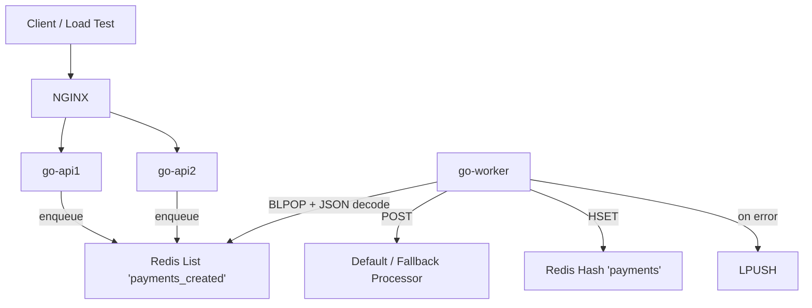

# 🏗️ Rinha de Backend 2025 — Go Async Payment Processor

## 🏆 Result

This Go solution handles thousands of concurrent payment requests with:

* ✅ Low memory footprint
* ✅ Near-zero inconsistency on `amount`
* ✅ Fast response time (p99 under 6ms)
* ✅ No duplicated or dropped messages

> Designed for simplicity, robustness, and visibility — using only Go, Redis, and FastHTTP.

---

## 🧬 Core Architecture

This solution implements an asynchronous **payment gateway delegator**, backed by:

* `Redis` (queue + state)
* `fasthttp` (ultrafast HTTP server)
* `goroutines` (concurrent worker pool)
* `requeue-on-failure` (manual at-least-once delivery)

It consists of:

* **Two API nodes (`api1`, `api2`)**: receive requests and enqueue them to Redis
* **One Worker (`go-worker`)**: processes the queue with 1000 concurrent workers
* **NGINX**: load balances traffic between API nodes
* **Redis**: stores queue (`payments_created`) and processed records (`payments`)

---

## 🧬 Architecture Diagram



---

## 🚀 Flow Overview

### 💸 Payment Submission

1. `POST /payments` receives a JSON payload (`correlationId`, `amount`)
2. Validated and serialized to Redis via `RPUSH payments_created`
3. Immediately responds with `202 Accepted`

### ↻ Queue Processing

1. Worker uses `BLPOP` to consume messages from `payments_created`
2. Deserializes payload and selects a processor (`default` or `fallback`)
3. Calls the corresponding external processor with `requestedAt` timestamp
4. If successful:

   * Stores result in Redis via `HSET payments`

5. If failed:

   * Requeues the JSON payload back into `payments_created`

---

## 🧠 Processor Selection Logic

Selection happens before each dispatch:

* Uses cached value from Redis (`selected_payment_processor`)
* Value is updated every 5s by the healthcheck cron

### Selection Rules:

* ✅ Prefer default if healthy
* ✅ Use fallback if default is failing
* ✅ Compare latencies if both healthy (switch if latency >50ms)
* ✅ Fallback to default if both are failing

Selection is stored in Redis:

```json
{
  "current_processor": "default",
  "ts": "2025-07-15T23:59:00Z"
}
```

---

## 🮥 Distributed Healthcheck

The worker includes a background job that:

* Runs every 1s
* Uses Redis `SET NX` lock (`healthcheck:lock`) with 5s TTL
* Hits both processors (`/admin/health`)
* Updates the selection (`selected_payment_processor`) with latency info

This ensures:

* 🔒 Single leader runs healthcheck
* ⏱ Selection changes only if justified (latency or failure)
* 📉 Processor is never picked if marked as "failing"

---

## 📊 Summary Endpoint

The API provides:

* `GET /payments-summary?from=...&to=...`

* Filters entries from Redis `payments` hash using `requestedAt`

* Aggregates:

  ```json
  {
    "default": {
      "totalRequests": 123,
      "totalAmount": 456.78
    },
    "fallback": {
      "totalRequests": 45,
      "totalAmount": 90.12
    }
  }
  ```

* Streaming is not implemented, but memory usage is low due to compact entry structure and Redis HScan fallback if needed.

---

## 📂 API Reference

| Method | Path                | Description                            |
| ------ | ------------------- | -------------------------------------- |
| POST   | `/payments`         | Enqueues a payment to the Redis queue  |
| GET    | `/payments-summary` | Returns aggregate totals per processor |
| POST   | `/purge-payments`   | Deletes all Redis payment entries      |
| GET    | `/healthcheck`      | Internal healthcheck (checks Redis)    |

---

## 🨠 Key Internals

### Worker Logic

* 1000 workers running in parallel (`defaultWorkers = 1000`)
* Buffered `chan []byte` for deserialized payloads
* `BLPOP` used to avoid CPU spinning
* On failure, payment is **requeued**
* Persisted via `HSET` after successful delivery

### Redis Keys Used

| Key                          | Type   | Purpose                       |
| ---------------------------- | ------ | ----------------------------- |
| `payments_created`           | List   | Enqueue payments              |
| `payments`                   | Hash   | Store results by ID           |
| `selected_payment_processor` | String | Cached processor choice       |
| `healthcheck:lock`           | String | Lock key for processor checks |

---

## 📦 Deployment (Docker Compose)

```yaml
services:
  redis:
    image: redis:8.0.3-alpine
    deploy:
      resources:
        limits:
          cpus: "0.25"
          memory: "70MB"

  api1:
    build: .
    command: ["api"]
    deploy:
      resources:
        limits:
          cpus: "0.25"
          memory: "60MB"

  api2:
    build: .
    command: ["api"]
    deploy:
      resources:
        limits:
          cpus: "0.25"
          memory: "60MB"

  worker:
    build: .
    command: ["worker"]
    deploy:
      resources:
        limits:
          cpus: "0.5"
          memory: "120MB"

  nginx:
    image: nginx:1.29.0-alpine
    volumes:
      - ./containers/nginx/nginx.conf:/etc/nginx/nginx.conf:ro
    ports:
      - "9999:9999"
    deploy:
      resources:
        limits:
          cpus: "0.25"
          memory: "40MB"
```

### Total Allocation

| Service   | CPU     | Memory    |
| --------- | ------- | --------- |
| Redis     | 0.25    | 70MB      |
| API x2    | 0.50    | 120MB     |
| Worker    | 0.50    | 120MB     |
| NGINX     | 0.25    | 40MB      |
| **Total** | **1.5** | **350MB** |

---

## 🛡️ Reliability & Safety

* At-least-once delivery by design (requeue on failure)
* Payments are idempotent (`correlationId`-based)
* Failure handling via retry + fallback processor
* Redis used for both queue and durability

---

## 📌 Observations

* Currently no deduplication — rely on external caller for idempotency
* Redis persistence (`appendonly`) is off for performance (ephemeral data)
* Can be improved by:

  * Batching `HSET` for less Redis pressure
  * Using a dedicated `persistChan` with a worker
  * Compressing Redis entry format (e.g. msgpack or CSV)

---

## 🧰 Stack

* **Language:** Go
* **HTTP Server:** [fasthttp](https://github.com/valyala/fasthttp)
* **Queue:** Redis
* **Orchestration:** Docker Compose
* **External Processors:** Default & Fallback (via HTTP JSON)

---

## 🏑️ Final Thoughts

This Go implementation is optimized for speed, low memory, and high resilience under load.
It’s a solid foundation to explore advanced queue strategies (e.g. Redis Streams, Worker Pools, Circuit Breakers), and already delivers strong throughput with clean separation of concerns.
